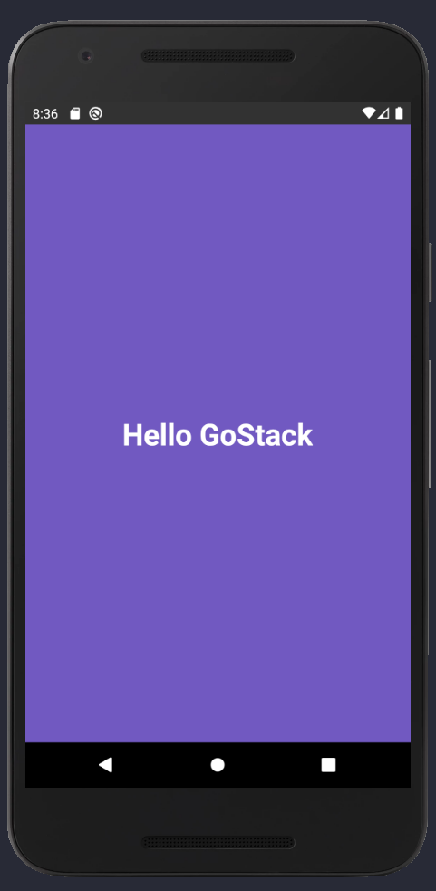

<h1 align="center">
    
    <br>
    ReactJS VS React Native
</h1>

<h3 align="center">Overview</h3>
<p align="center">
  <a href="#differences">Differences</a>&nbsp;&nbsp;&nbsp;|&nbsp;&nbsp;&nbsp;
  <a href="#components">Components</a>&nbsp;&nbsp;&nbsp;|&nbsp;&nbsp;&nbsp;
  <a href="#examples">Examples</a>
</p>

## Differences

Despite the similar component declaration or syntax, there are a few differences between ReactJS and React Native that are worth mentioning.

| ReactJS/Regular Web Dev | React Native |
| --- | --- |
| HTML Elements **with semantic value** | React Native Components (View, text, etc) **without semantic value** |
| Text elements start with a "standard" styling (h1 > h2) | Elements don't start with a "standard" styling* |
| Need to declare layout display type | Standard layout is set `display: flex (flexbox)` |
| :heavy_check_mark: Styling inheritance | :x: Styling Inheritance |

**: All the differiation between these elements must be done through CSS.*

## Components

To simplify this mini-tutorial, I'll start by mentioning View and Text Components.

### 📦 View
It replaces any type of HTML container. View components can be used as:
- div;
- section;
- header;
- footer;
- aside; etc.

### 🔤 Text
It replaces any type of HTML text. Text components can be used as:
- p;
- h1;
- h2;
- h3;
- span;
- strong; etc.

*See the [official documentation](https://reactnative.dev/docs/intro-react-native-components#__docusaurus) for the complete list of React Native Components.*

## Examples

### Example 1: Create a StyleSheet component
*Parameters inside our properties must be in CammelCase format.*

```javascript
import React from 'react';
import { View, Text, StyleSheet } from 'react-native';

export default function App() {
    return <View style={styles.container} />;
}

const styles = StyleSheet.create({
    container: {
        flex: 1,
        backgroundColor: '#7159c1',
    },
});
```
Observation:

`flex: 1` = It makes the container ocupy the whole screen.

### Example 2: Add a centered text element
```javascript
import React from 'react';
import { View, Text, StyleSheet } from 'react-native';

export default function App() {
    return (
        <View style={styles.container}>
            <Text style={styles.title}>Hello GoStack</Text>
        </View>
    );
}

const styles = StyleSheet.create({
    container: {
        flex: 1,
        backgroundColor: '#7159c1',
        justifyContent: 'center',
        alignItems: 'center',
    },
    title: {
        color: '#FFF',
        fontSize: 32,
        fontWeight: 'bold',
    }
});
```
Observation:

Since we **don't** have styling inheritance in React Native, we can't set the `fontSize` or `color` of our text elements inside our container. Thus, we need to set the styling parameters for *each element*.

### Example 3: Customize the Status Bar

```javascript
import React from 'react';
import { View, Text, StyleSheet, StatusBar } from 'react-native';

export default function App() {
    return (
        <>
            <StatusBar barStyle="light-content" backgroundColor="#333" />
            
            <View style={styles.container}>
                <Text style={styles.title}>Hello GoStack</Text>
            </View>
        </>
    );
}

const styles = StyleSheet.create({
    container: {
        flex: 1,
        backgroundColor: '#7159c1',
        justifyContent: 'center',
        alignItems: 'center',
    },
    title: {
        color: '#FFF',
        fontSize: 32,
        fontWeight: 'bold',
    }
});
```

Observation:

- Just like in ReactJS, we cannot have two elements listed on top of each other without being inside another container. We can use a `fragment (<>   </>)` instead of a view in the same way we do in react.

- StatusBar Customization (option: `parameter`):
    - Text Color: `barStyle`
    - Background Color: `backgroundColor`
    - Translucent Bar on scrolling: `translucid`
    - etc

### Output:

<p align='center'>
    
</p>

See the [React Native
Documentation](https://reactnative.dev/docs/getting-started) for more details.

---
Made with :heart: by Wilson Franca :wave: [Get in touch!](https://www.linkedin.com/in/wilsonfranca-env-engineer/)


